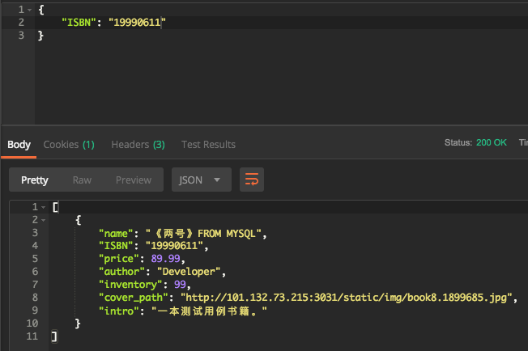

# README

## 1. 启动

```bash
cd ./ebook-backend
# initialize database
mysql -u root -p
> source ./DB/ebook.sql
exit
# run spring-boot
mvn spring-boot:run
```

on port :8080

## 2. API

1. /get_book

   - method: post;

   - content: {"ISBN": "123456789"};

   - return: JSONObject bookInfo;

   - Connect with DB

     ```java
     @RequestMapping(value = "/get_book", method = RequestMethod.POST, produces = "application/json;charset=UTF-8")
         @ResponseBody
         public List<Map<String, Object>> get_book(@RequestBody JSONObject input) throws IOException {
             String isbn = (String) input.get("ISBN");
             String sql = "select * from  book_brief where ISBN='" + isbn + "';";
             List<Map<String, Object>> res = this.jdbcTemplate.queryForList(sql);
             return res;
         }
     ```

     


## 3. Database

1. 创建脚本:

   路径: ```./DB/ebook.sql```

2. application.properties配置

   ```properties
   spring.datasource.url=jdbc:mysql://localhost:3306/ebook
   spring.datasource.username=root
   spring.datasource.password=
   spring.datasource.driver-class-name=com.mysql.cj.jdbc.Driver
   ```

   