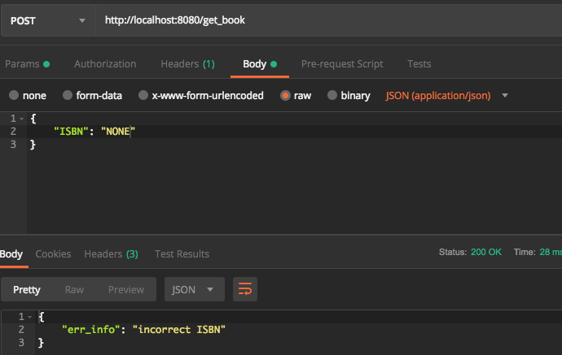
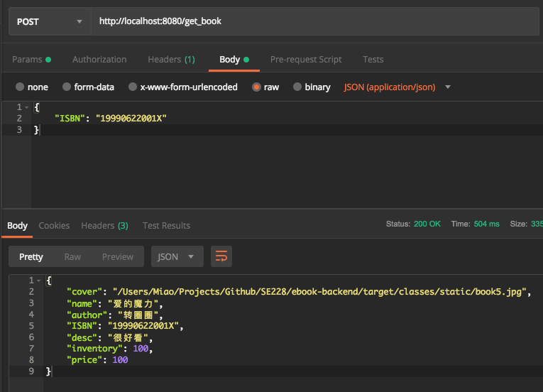

# README

## 1. 启动

```bash
cd ./ebook-backend
mvn spring-boot:run
```

on port :8080

## 2. API

1. /get_book

   - method: post;
   - content: {"ISBN": "123456789"};
   - return: JSONObject bookInfo;

   

   

