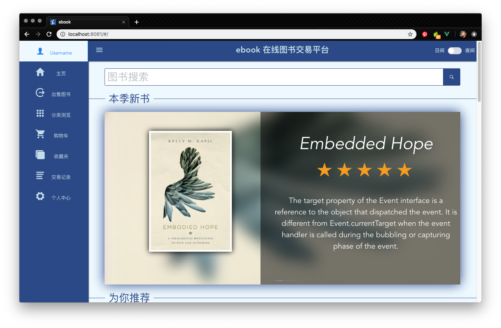

# ebook

> 516015910018 Wei Xiao Miao 
>
> SE228 project 
>
> 本工程前端选用Vue框架, 是一个标准的Vue工程(无hibernation)

## 0. 启动工程

本工程采用npm管理依赖, 请确保您的设备上安装了npm

``` bash
$home cd localPath/SE228/ebook
# install dependencies
$ebook npm install
# serve with hot reload at localhost:8080
$ebook npm run dev
```

单元测试将选用jest框架(待编写); e2e测试将选用nightwatch + ChromeDriver(待编写)

```bash
# run unit test 
$ebook npm run test
# run e2e test
$ebook nightwatch test
```

## 1. 更新记录

### 1.1 2019-3-8 第二周作业

1. 3-5 创建repo SE228
2. 3-5 使用vue-cli初始化工程
3. 3-6 完成主页**(详见2.1)**和相关路由
4. 3-7 完成图书浏览页**(详见2.2)**和图书详情页**(详见2.3)**
5. 3-8 为工程添加dark和light两份css表, 用作主题切换**(详见5.1)**

### 1.2 2019-3-15  第三周作业

1. 3-13 修改首页Slider

2. 3-14 实现点击首页图书卡片名称后的变色功能

   功能代码 详见```ebook/src/components/user/display/book_grid.vue```

   

   ```html
   <p style="font-size: 16px; font-weight: bold" @click="changeColor($event)">{{book.name}}</p>
   ```

   ```javascript
   changeColor (event) {
      if (event.target.style.color === 'rgb(216, 74, 45)') {
        event.target.style.color = '#000'
      } else {
        event.target.style.color = 'rgb(216, 74, 45)'
      }
   }
   ```

3. 3-15 完成注册也页面和会话框确认提示**(详见2.4)**

   

## 2. 页面介绍

### 2.0 layout.vue (基础框架组件)


- 路径:  ```ebook/src/components/user/layout.vue```
- 路由: null (基本框架组件, 无独立页面)
- 组件: 
  - ```<Sider>``` : iview组件库中的组件, 侧边导航栏.
  - ```<Header>``` : iview组件库中的组件, 顶部标题栏.
    - ```<el-swich>``` : element组件库组件, 用来切换主题风格.
  - ```<router-view>``` : 中部可变内容, 由路由控制
- 功能: 为根路径下的页面提供基础框架
- 动态数据:  用户信息 (待补充...) 

### 2.1 homepage.vue



- 路径:  ```ebook/src/components/user/display/homepage.vue```
- 路由: ``` http://localhost:8080/```
- 组件:
  - ```<slider>``` : 图片轮播盘, 详见./pic_slider.vue
  - ```<grid>``` : 图书展示列表, 详见./book_grid.vue
    - ```<card>``` : iview的组件, 图书展示卡片
- 功能: 用户登陆后的主页面
- 动态数据: 图书格式json (待补充)

### 2.2 book_detail.vue  


- 路径:  ```ebook/src/components/user/display/book_detail.vue```
- 路由: ``` http://localhost:8080/#/bookdetail/{bookID}```
- 组件: 
  - ```<card>``` : iview的组件, 图书信息卡片
  - ```<Collapse>``` : iview的组件, 图书详情卡片
- 功能: 用户点击某图书后的详细页面(click事件已完成)
- 动态数据: 图书格式json, 评级信息 (待补充...)

### 2.3 market.vue


- 路径:  ```ebook/src/components/user/display/market.vue```
- 路由: ``` http://localhost:8080/#/market```
- 组件: 
  - ```<card>``` : iview的组件, 图书信息卡片
  - ```<Tabs>``` : iview的组件, 图书分类标签
- 功能: 用户点击分类浏览后的图书购买页面(click事件已完成)
- 动态数据: 图书格式json, 分类信息 (待补充...)

### 2.4 register.vue


- 路径: ```ebook/src/components/user/uer_sys/register.vue```
- 路由: ```http://localhost:8081/#/user/register```
- 组件: 
  - ```<card>``` : iview的组件, 图书信息卡片
  - ```<modal>```: iview对话框组件, 确认用户注册信息
- 功能: 提交用户注册表单
- 动态数据: 用户注册表单

## 3. 路由介绍

```javascript
routes: 
  [
    {
      path: '/',
      component: loadView('user/layout'),
      children: [
        {
          path: '',
          name: 'homepage',
          component: loadView('user/display/homepage')
        },
        {
          path: 'market',
          name: 'market',
          component: loadView('user/display/market')
        },
        {
          path: 'book_detail/:id',
          name: 'book',
          component: loadView('user/display/book_detail')
        }
    },
    {
      path: '/user/register',
      name: 'register',
      component: loadView('user/user_sys/register')
    }
        // 待补充
      ]
    }
  ]
```

## 4. 接口定义

## 5. 其他静态数据描述

### 5.1 theme.css

- 路径: ```ebook/static/```
- 功能: 两份全局css表作为风格切换, 点击右上角```日间/夜间```开关可切换
- 其他: ```!important```后缀为了复写组件库中的样式

### 5.2 book.jpg

- 路径: ```ebook/src/assets```
- 功能: 图书封面样张
- 其他: user_bkgd.png为注册页面背景图

## 6. 测试

### 6.1 单元测试实例

### 6.2 e2e测试实例

